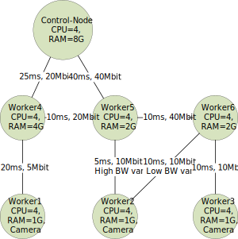

# Scenario 1: Traffic Hazard Detection

This scenario deploys an instance of the following application:

The application consists of the following microservices:

* HazardDetector Service:
    * Watches the street and detects if there is a hazard on the road (e.g., an animal or a broken down car).
    * Runs on a node that has a camera attached.
    * If a hazard is detected, the Hazard Detector sends this information and the segment of the video to the AlertValidator.
* AlertValidator Service:
    * Runs on a more powerful node than the HazardDetector.
    * Validates that there is a hazard using a more complex detection model and, if hazard is real, broadcasts this information immediately to all vehicles in its range via 5G.
    * Forwards the hazard info to the AlertManager.
* AlertManager Service:
    * Collects alerts from multiple sources.
    * Decides which vehicles in the greater vicinity need to be informed and informs them via AMQP.
    

The scenario uses [kind](https://kind.sigs.k8s.io/) to create a test cluster with 7 fog nodes.
The following image shows the configuration of the cluster nodes and the configured cluster topology:

## Instructions for Running the Scenario

**Prerequisites:**
* Docker
* [kind](https://kind.sigs.k8s.io/)

1. Open a terminal in `scenario-01` and run `cd prerequisites`
1. Run `./start-kind-with-local-registry.sh`
1. In a second terminal run `kubectl proxy`
1. Run `./create-extended-resources.sh localhost:8001`
1. Run `kubectl apply -f ./cluster-topology.yaml`
1. `cd ..` to get back to the scenario's main folder
1. Run `kubectl get pods --all-namespaces` to find the pod names of the schedulers.
1. Open [run-all-experiments.sh](./run-all-experiments.sh) and set the variables at the top to the corresponding schedulers' pod names to enable retrieval of scheduler logs and configure the number of iterations.
1. To execute the tests, run `./run-all-experiments.sh`
1. Each test will create a `results` folder in the folder of the respective scheduler.

## Scenario Details

The test script ([./run-single-experiment.sh](./run-single-experiment.sh)) is executed for once for every scheduler.

It executes the configured number of iterations of the following process:

1. Add n instances of the application to the cluster.
1. Wait for a configurable amount of time (see `longSleepTime` in the script).
1. Dump the target namespaces and all nodes to an output JSON file.
1. Delete the target namespaces to remove the deployed application.
