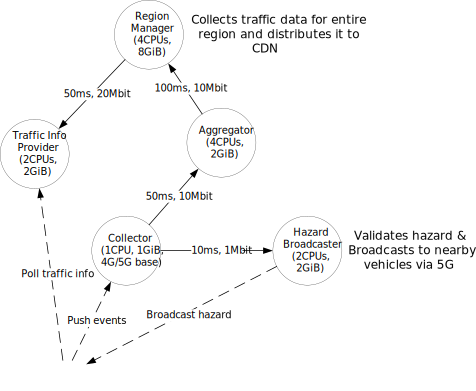

# Scenario 2: Traffic Monitoring and Hazard Detection

This scenario deploys an instance of the following application:

The application consists of the following microservices:

* Collector Service:
    * Receives events from cars in the vicinity about their movement.
    * Runs on a 5G base station node.
    * Performs initial filtering of data and detects if there is a hazard on the road.
    * Data are forwarded to the Aggregator Service and hazards are also forwarded to the next HazardBroadcaster service.
* Aggregator Service:
    * Runs on a more powerful node than the Collector.
    * Aggregates traffic and hazard data from multiple Collectors.
    * Forwards the aggregated data to the RegionManager.
* HazardBroadcaster Service:
    * Receives hazard alerts from a Collector.
    * Determines within which vicinity vehicles need to be informed immediately and notifies them via 5G.
* RegionManager Service:
    * Runs on a powerful node.
    * Aggregates traffic and hazard data from all Aggregators in the region into a unified traffic view of this region
    * Forwards the unified traffic view to Traffic Info Providers nodes.
* TrafficInfoProvider Service:
    * Allows cards to periodically pull updates to the unified traffic view of the region. 

The scenario uses [kind](https://kind.sigs.k8s.io/) to create a test cluster and [fake-kubelet](https://github.com/wzshiming/fake-kubelet) to add 120 simulated nodes to this cluster.
The cluster consists of 10 subclusters of 1 cloud node and 11 fog nodes each - all cloud are interconnected and thus form the bridges between the subclusters.
The following image shows the configuration the cluster topology of a single subcluster:

## Instructions for Running the Scenario

**Prerequisites:**
* Docker
* [kind](https://kind.sigs.k8s.io/)

1. Open a terminal in `scenario-02` and run `cd prerequisites`
1. Run `./start-cluster.sh`
1. `cd ..` to get back to the scenario's main folder
1. Run `kubectl get pods -A | grep scheduler` to find the pod names of the schedulers.
1. Open [run-all-experiments.sh](./run-all-experiments.sh) and set the variables at the top to the corresponding schedulers' pod names to enable retrieval of scheduler logs and configure the number of iterations.
1. To execute the tests, run `./run-all-experiments.sh`
1. Each test will create a `results` folder in the folder of the respective scheduler.
1. Once you are done, run `kind delete cluster` to delete the test cluster again.

## Scenario Details

The test script ([./run-single-experiment.sh](./run-single-experiment.sh)) is executed for once for every scheduler.

It executes the configured number of iterations of the following process:

1. Add n instances of the application to the cluster.
1. Wait for a configurable amount of time (see `longSleepTime` in the script).
1. Dump the target namespaces and all nodes to an output JSON file.
1. Delete the target namespaces to remove the deployed application.
